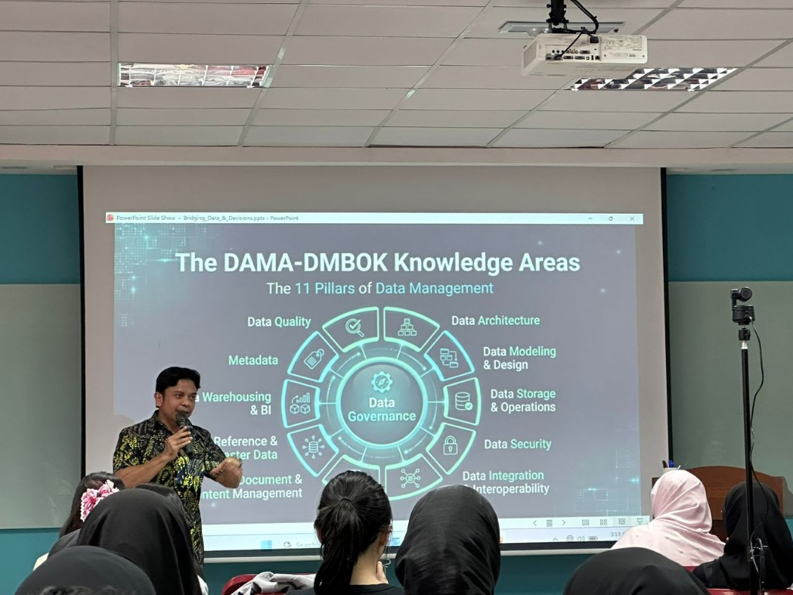
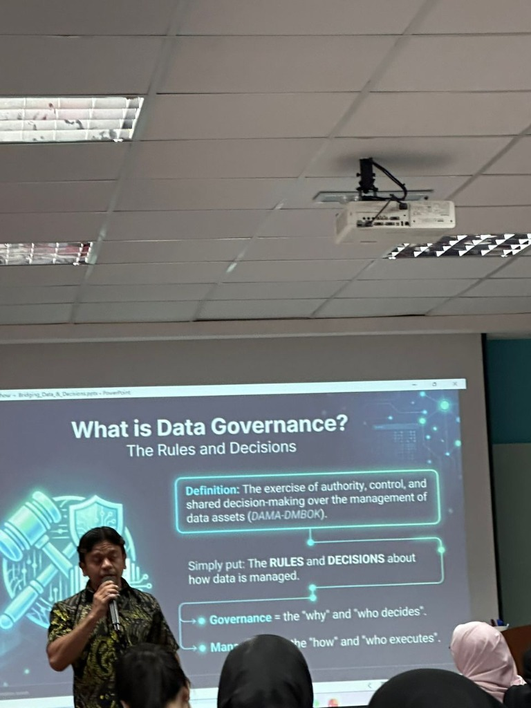
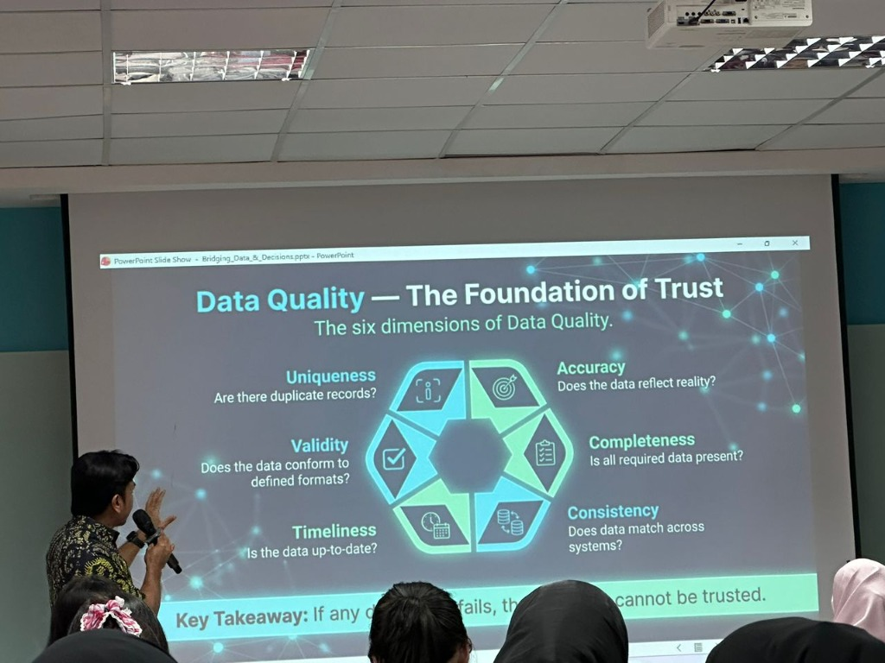

# 💡 Data Governance: More Than Just Data

## 📅 Event Details
- **Speaker:** Mr. Faiz Fabilillah
- **Topic:** Data Governance and Business Intelligence
- **Participants:** UTM Students

---

## 📸 Media Highlights

````carousel

<!-- slide -->

<!-- slide -->

````

---

## 🔍 Key Highlights & Learnings

### 1. DAMA-DMBOK Knowledge Areas (The 11 Pillars of Data Management)
The talk introduced the standard **DAMA-DMBOK** framework where **Data Governance** sits at the center, coordinating and enabling 10 other key disciplines:
- Data Quality
- Data Architecture
- Data Modeling & Design
- Data Storage & Operations
- Data Security
- Data Integration & Interoperability
- Document & Content Management
- Reference & Master Data
- Data Warehousing & Business Intelligence (BI)
- Metadata Management

### 2. What is Data Governance?
- **Definition:** The exercise of authority, control, and shared decision-making over the management of data assets (DAMA-DMBOK).
- **Core Distinction:**
  - **Governance:** Focuses on the *"why"* and *"who decides"* (defining rules, policies, and ownership).
  - **Management:** Focuses on the *"how"* and *"who executes"* (implementing and executing the governance policies).

### 3. The 6 Dimensions of Data Quality
A critical point made during the talk was that **dashboards are only as good as the data feeding them**. Data quality rests on six key dimensions:
1. **Uniqueness:** Are there duplicate records?
2. **Validity:** Does the data conform to defined formats?
3. **Timeliness:** Is the data up-to-date?
4. **Accuracy:** Does the data reflect reality?
5. **Completeness:** Is all required data present?
6. **Consistency:** Does data match across different systems?

> [!IMPORTANT]
> **Key Takeaway:** If any of these six dimensions fail, the integrity of the data is compromised, and the data cannot be trusted for critical business decisions.

---

## 💭 Reflection

> "Had the opportunity to attend an industry talk by Mr. Faiz Fabilillah on Data Governance and Business Intelligence.
>
> One key takeaway was that even the most impressive dashboards can be misleading if the underlying data is inaccurate. This session reinforced the importance of data quality and governance in making better business decisions.
>
> Thank you for the valuable sharing! 🚀"
>
> — **Dheshieghan (A23CS0072)**
