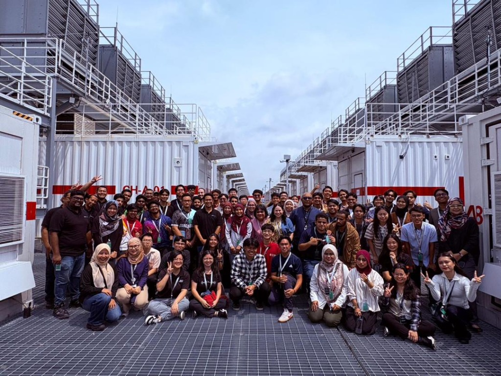
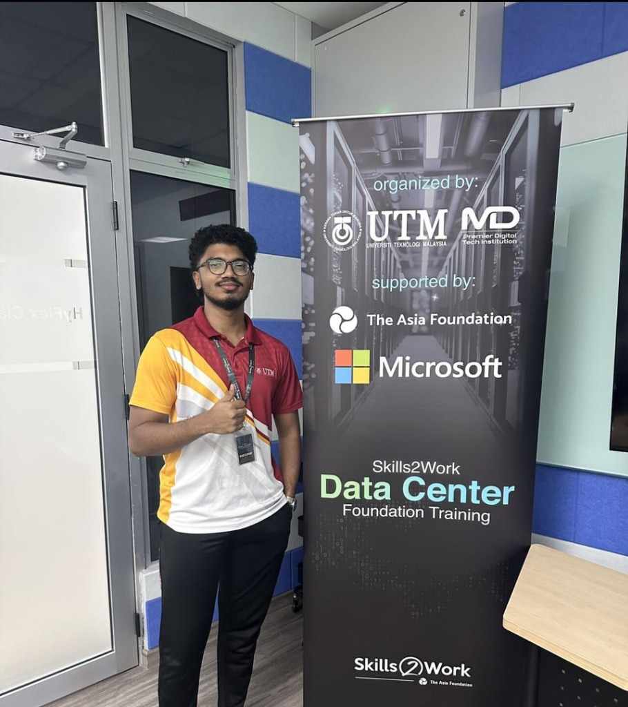
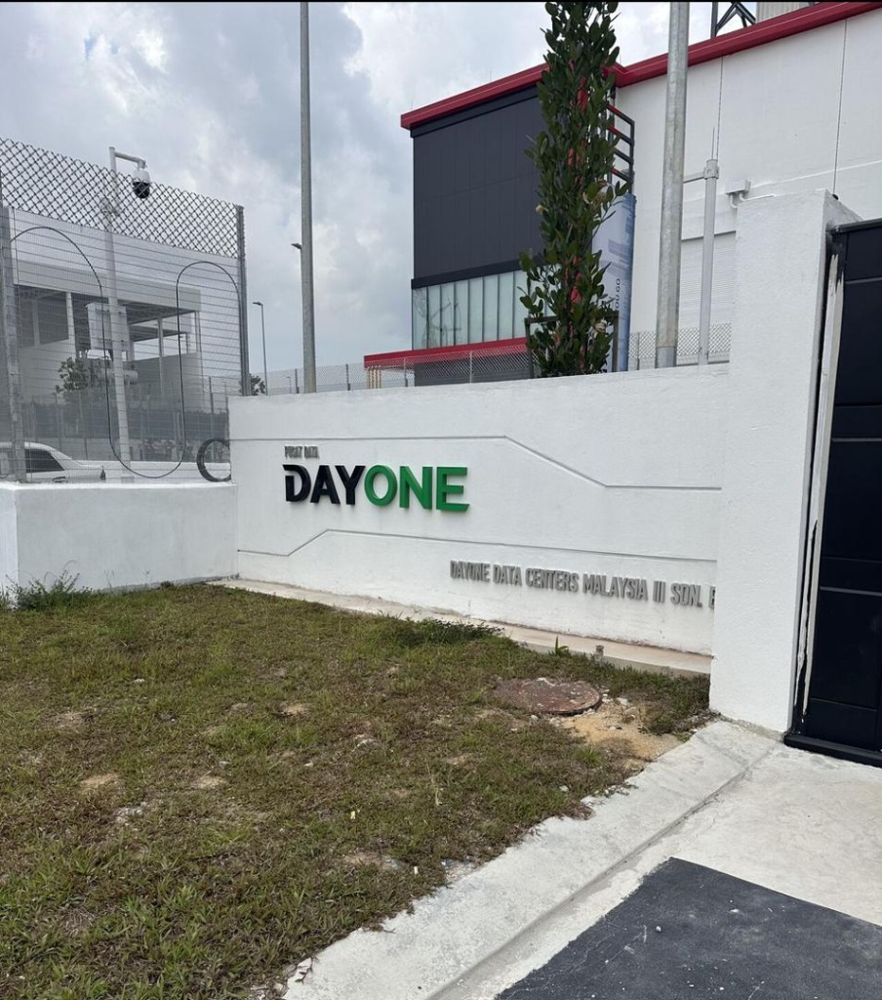

# 🌐 Skills2Work Data Center Foundation Training & DayOne Data Center Visit

## 📋 Overview
The **Skills2Work Data Center Foundation Training** is an intensive program organized by **Universiti Teknologi Malaysia (UTM)** and **Microsoft**, with the support of **The Asia Foundation** and **MD (Premier Digital Tech Institution)**. The program provides participants with essential insights into data center operations, foundational infrastructure, and future-ready digital skills.

A major highlight of this training camp was an industrial visit to **DayOne Data Centers Malaysia**, providing first-hand exposure to how modern data centers are managed, cooled, powered, and operated at scale.

---

## 📸 Media Highlights

````carousel

<!-- slide -->

<!-- slide -->

````

---

## ⚡ Key Insights & Learnings

### 1. Data Center Operations & Infrastructure
- Hands-on understanding of data center layouts, server racks, and power distribution units (PDUs).
- Deep dive into critical utility infrastructure: cooling systems (chillers, cooling towers), backup generators, and uninterruptible power supply (UPS) configurations.
- Focus on modular and containerized data center setups (as seen in the group photo).

### 2. Digital & Technological Competencies
- Introduction to cloud architecture, network virtualization, and storage setups.
- Industry-standard procedures for server maintenance, cabling, security, and hardware diagnostics.

### 3. Industrial Visit: DayOne Data Centers Malaysia
- Observed real-time site management practices.
- Explored server halls and physical security architectures.
- Witnessed how power grid redundancy and environmental monitoring software maintain 99.999% uptime.

---

## 💭 Reflection

> "Honored to be part of the Skills2Work Data Center Foundation Training, organized by UTM and Microsoft, with support from The Asia Foundation.
>
> The program gave me valuable insights into data center operations, infrastructure, and future-ready digital skills. A highlight of the camp was the industrial visit to DayOne Data Centers Malaysia, where we got first-hand exposure to how modern data centers are managed and operated. ⚡💡
>
> Grateful for this opportunity to learn, connect, and grow with fellow participants, and excited to apply these skills in my journey ahead! 🚀"
>
> — **Dheshieghan (A23CS0072)**
