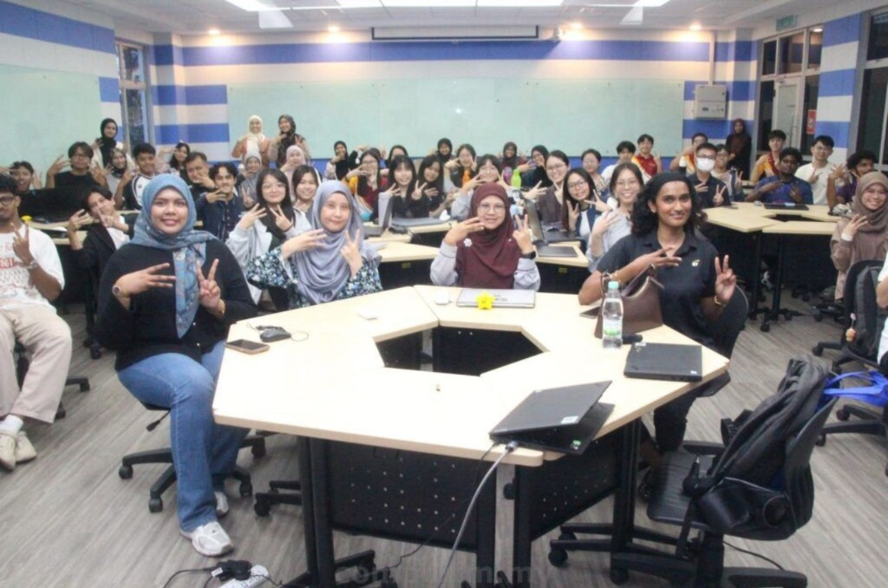

# ✨ A Valuable Experience with EY Industry Talk

## 📅 Event Details
- **Company:** EY (Ernst & Young)
- **Host:** Universiti Teknologi Malaysia (UTM)
- **Topic:** EY Company Culture, Career Opportunities, and Professional CV Building
- **Participants:** UTM Students

---

## 📸 Media Highlights

---

## 🔍 Key Highlights & Learnings

### 1. EY Culture & Opportunities
- Gained insights into EY's work culture, global networks, and career path options for technology and data graduates.
- Explored corporate practices, expectation settings, and training programs at EY.

### 2. Practical Data Pipelines
- Participated in an engaging discussion on **data pipelines**.
- Learned how concepts taught in the classroom (like database design, ETL processes, and data cleaning) translate into real-world business environments to support enterprise analytics and operations.

### 3. CV & Professional Profile Workshop
- Received actionable feedback and guidelines on crafting high-impact resumes.
- Learned strategies to highlight tech projects, academic accomplishments, and soft skills to present a stronger professional profile.

---

## 💭 Reflection

> "Had the opportunity to attend the EY Industry Talk at UTM and learn more about the company’s culture, career opportunities, and industry practices.
>
> One of the most interesting discussions was on data pipelines and how classroom concepts are applied in real business environments. The CV workshop also provided useful tips on building a stronger professional profile.
>
> Thank you to EY and the organizers for the insightful session."
>
> — **Dheshieghan (A23CS0072)**
