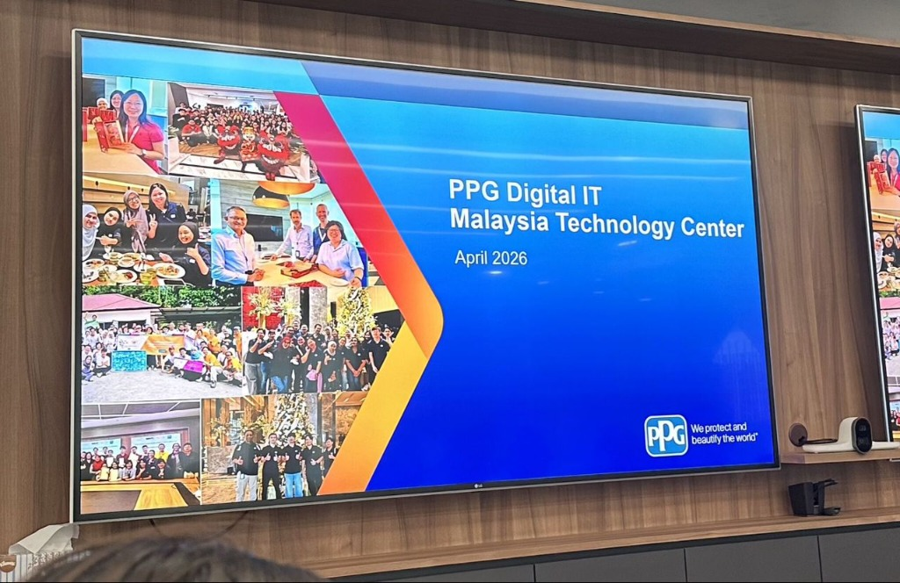

# 🏢 Industrial Visit to PPG Digital IT Malaysia Technology Center

## 📅 Event Details
- **Date:** 7 April 2026
- **Location:** PPG Digital IT Malaysia Technology Center
- **Participant:** Dheshieghan (A23CS0072)

---

## 📸 Media Highlights

````carousel

<!-- slide -->

````

---

## 🔍 Key Highlights & Learning Outcomes

### 1. Data-Driven Coatings Industry
- Gained valuable insights into how data drives operations within the coatings industry, spanning from **process optimization** to **quality control** and **strategic decision-making**.
- Learned how data science and analytics are integrated into manufacturing workflows to minimize waste and ensure paint quality consistency.

### 2. Monitoring & Systems
- Explored how **structured data workflows** and **real-time monitoring** play a key role in improving plant efficiency and maintaining global quality standards.
- Understood the pipeline of data collection from manufacturing machinery sensors to cloud-hosted dashboards.

### 3. Industry Transformation
- Reinforced the importance of data in transforming traditional chemical and coatings manufacturing processes into smarter, self-optimizing, and more efficient systems.

---

## 💭 Reflection

> "Grateful for the opportunity to visit PPG on 7 April 2026.
>
> During the visit, I gained valuable insights into how data drives operations within the coatings industry from process optimization to quality control and decision-making. It was interesting to see how structured data workflows and real-time monitoring play a key role in improving efficiency and maintaining high standards.
>
> Experiences like this reinforce the importance of data in transforming traditional industries and shaping smarter, more efficient systems.
>
> Thank you to the team at PPG for the informative session and for sharing your expertise."
>
> — **Dheshieghan (A23CS0072)**
