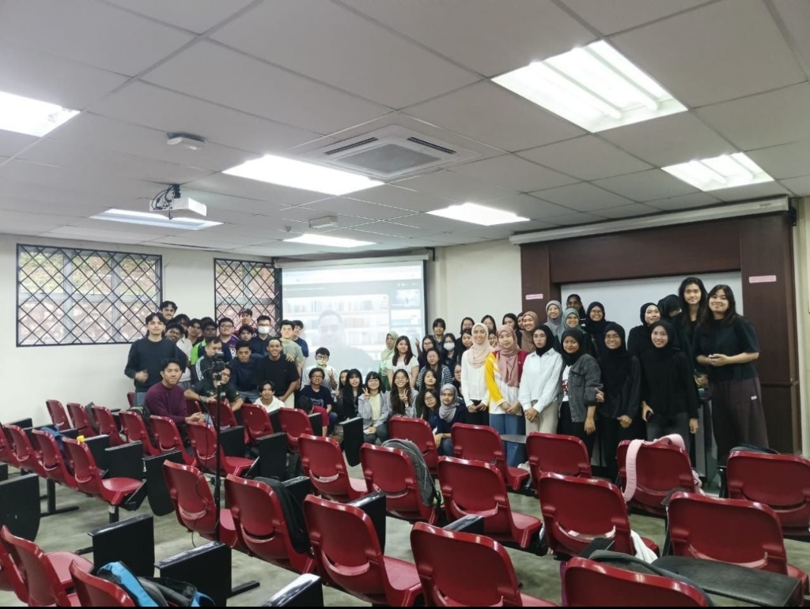

# 🌐 Industry Sharing: Enterprise Data Systems with TM ONE

## 📅 Event Details
- **Speaker:** Mr. Zaid Waqi Zulkifli (TM ONE)
- **Topic:** Enterprise Data Systems & Architectures
- **Participants:** UTM Students

---

## 📸 Media Highlights

---

## 🔍 Key Highlights & Learnings

### 1. Dynamics of Enterprise Data Architectures
- Explored how modern enterprises structure their data systems.
- Understood that rapidly changing business requirements create significant challenges in maintaining efficient, scalable, and reliable data architectures.
- The session highlighted the need for flexible design patterns that can adapt to changing analytical and operational requirements.

### 2. The Holistic Data Professional (Beyond Tech Skills)
A critical insight from the speaker was that technical capabilities (like SQL, Python, or Cloud platforms) are only one part of the equation. To succeed in the industry, professionals must develop:
- **Effective Communication:** Translating complex data structures into actionable business terms.
- **Adaptability:** Responding to shifting priorities and new database technologies.
- **Business Requirements Understanding:** Designing architectures that solve actual business challenges, rather than just building technically complex systems.

---

## 💭 Reflection

> "Recently attended an insightful industry sharing session by Mr. Zaid Waqi Zulkifli on enterprise data systems.
>
> One key takeaway was understanding how rapidly changing business needs create challenges in maintaining efficient and reliable data architectures.
>
> The session also highlighted that technical skills alone are not enough—communication, adaptability, and understanding business requirements are equally important in the data industry.
>
> Grateful for the opportunity to gain these valuable industry insights."
>
> — **Dheshieghan (A23CS0072)**
