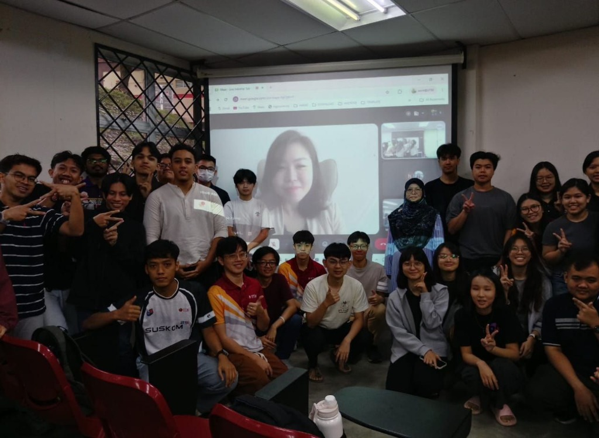

# 💡 Industry Insights with iZeno

## 📅 Event Details
- **Company:** iZeno
- **Topic:** Real-world Technology Projects, Trends, & Career Insights
- **Participants:** UTM Students

---

## 📸 Media Highlights

---

## 🔍 Key Highlights & Learnings

### 1. Real-World Tech Implementations
- Gained valuable exposure to how enterprise-level technology projects are managed and delivered in the industry.
- Explored current industry trends, with a focus on cloud solutions, DevOps, and customer relationship management (CRM) systems.

### 2. Business Problem Solving
- Developed a better understanding of how tech stacks and data-driven solutions are strategically applied to solve complex business challenges.
- Learned about integration challenges and client-facing project delivery.

### 3. Career Experiences & Success Skills
- Heard first-hand career stories and advice from practicing tech professionals.
- Identified critical technical skills (modern application development, APIs, data analytics) and soft skills (problem-solving, teamwork, curiosity) required to succeed in the IT industry.

---

## 💭 Reflection

> "Today, I attended an industry sharing session by iZeno and gained valuable exposure to real-world technology projects, industry trends, and career experiences from professionals in the field.
>
> The session provided a better understanding of how technology and data-driven solutions are applied to solve business challenges, while also highlighting the skills needed to succeed in the industry.
>
> Thank you to the speakers and organizers for the inspiring sharing session."
>
> — **Dheshieghan (A23CS0072)**
