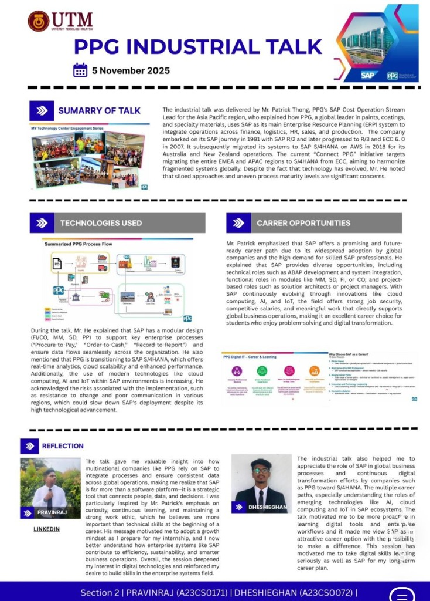
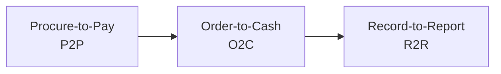

# 🎓 Industrial Talk with PPG – Insights into SAP & Global Enterprise Systems

## 📅 Event Details
- **Date:** 5 November 2025
- **Speaker:** Mr. Patrick Thong (PPG’s SAP CoE Operation Stream Lead for APAC)
- **Host Institution:** Universiti Teknologi Malaysia (UTM)
- **Contributors (Section 2):**
  - **Pravinraj** (A23CS0171)
  - **Dheshieghan** (A23CS0072)

---

## 📌 Poster Overview

---

## 🔍 Summary of the Talk

The industrial talk was delivered by **Mr. Patrick Thong**, PPG's SAP Cost/CoE Operation Stream Lead for the Asia Pacific region. He explained how PPG, a global leader in paints, coatings, and specialty materials, uses SAP as its main Enterprise Resource Planning (ERP) system to integrate operations across key business functions such as:
- Finance & Controlling (FI/CO)
- Materials Management / Logistics (MM)
- Sales & Distribution (SD)
- Production Planning (PP)
- Human Resources (HR)
- Procurement

### PPG's SAP Journey & Digital Transformation
Mr. Patrick walked us through PPG's digital transformation roadmap:
1. **1991:** Embarked on the SAP journey with **SAP R/2**.
2. **Evolution:** Progressed to **SAP R/3**.
3. **2007:** Upgraded to **SAP ECC 6.0**.
4. **2018:** Migrated Australia and New Zealand operations to **SAP S/4HANA on AWS**.
5. **Current "Connect PPG" Initiative:** Targets migrating the entire EMEA and APAC regions from ECC to S/4HANA to harmonize fragmented systems and establish a single source of truth globally.

> [!NOTE]
> **Key Challenge:** Despite major advancements in technology, Mr. Patrick highlighted that **siloed organizational approaches** and **uneven process maturity levels** across regions remain significant implementation concerns.

---

## 🛠️ Technologies & Processes

SAP's modular design enables seamless data flows across the organization, supporting core enterprise cycles:

### PPG Process Flow Summary
- **Purchasing (PO):** Creating Purchase Orders for Vendors.
- **Inventory/Warehouse:** Goods receipt, storage, and movement.
- **Sales & Delivery:** Handling Sales Orders, dispatching goods, and billing customers.
- **Finance:** Processing payments and accounting entries.

### Technology Trends
- **SAP S/4HANA Migration:** Provides real-time analytics, high-performance in-memory database processing, and cloud scalability.
- **Modern Tech Stack Integration:** Growing adoption of **Cloud Computing**, **Artificial Intelligence (AI)**, and the **Internet of Things (IoT)** within SAP environments.
- **Risks & Mitigation:** Successful deployments rely heavily on managing risks like user resistance to change and lack of effective regional communication.

---

## 💼 Career Opportunities in SAP

SAP offers a promising, high-demand, and future-ready career path with strong job security and competitive salaries:

- **Technical Roles:**
  - ABAP Development (Advanced Business Application Programming)
  - System Integration & Development
- **Functional Roles:**
  - Consultant/Specialist in modules like **MM**, **SD**, **FI**, or **CO**
- **Project-based & Strategic Roles:**
  - Solution Architects
  - IT Project Managers
- **Innovation Drivers:**
  - Roles focused on integrating SAP with **AI, IoT, and Cloud Computing**.

---

## 👤 Reflections

### 🔹 Pravinraj (A23CS0171)
> "The talk gave me valuable insight into how multinational companies like PPG rely on SAP to integrate processes and ensure consistent data across global operations, making me realize that SAP is far more than a software platform—it is a strategic tool that connects people, data, and decisions. I was particularly inspired by Mr. Patrick's emphasis on curiosity, continuous learning, and maintaining a strong work ethic, which he believes are more important than technical skills at the beginning of a career. His message motivated me to adopt a growth mindset as I prepare for my internship, and I now better understand how enterprise systems like SAP contribute to efficiency, sustainability, and smarter business operations. Overall, the session deepened my interest in digital technologies and reinforced my desire to build skills in the enterprise systems field."
>
> 🔗 **[Pravinraj's LinkedIn](https://www.linkedin.com)**

### 🔹 Dheshieghan (A23CS0072)
> "The industrial talk also helped me to appreciate the role of SAP in global business processes and continuous digital transformation efforts by companies such as PPG toward S/4HANA. The multiple career paths, especially understanding the roles of emerging technologies like AI, cloud computing and IoT in SAP ecosystems, were eye-opening. The talk motivated me to be more proactive in learning digital tools and enterprise workflows, and it made me view SAP as an attractive career option with the possibility to make a difference. This session has motivated me to take digital skills learning seriously as well as SAP for my long-term career plan."
